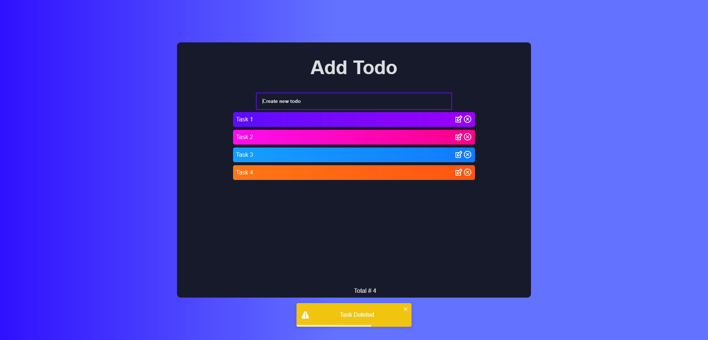

This is a React.js project bootstrapped with Vite.js

# React Todo APP using Vite

This is a simple todo app built with React.js and Vite.js.

Tecnologies used:

- React.js
- Vite.js
- Framer Motion
- React Icons
- React Toastify
- UUID

## Installation

```bash
  npm i

  npm run dev
```

## Demo

https://nicolas-deyros.github.io/vite-react-todo-app/

## Screenshots

#### Home Page


#### Tablet

-1024x1366.png>)

#### Mobile


#### Animation


#### Edit


#### Update


#### Delete



## License

[MIT](https://choosealicense.com/licenses/mit/)
