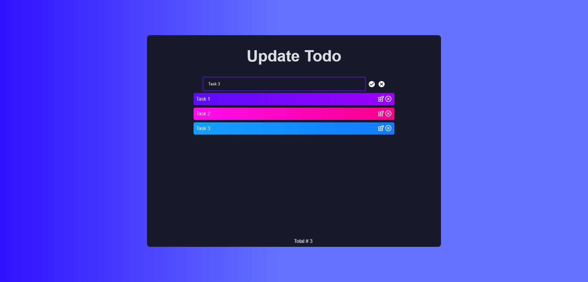

This is a React.js project bootstrapped with Vite.js

# React Todo APP using Vite

## Installation

```bash
  npm i

  npm run dev
```

## Demo

https://nicolas-deyros.github.io/vite-react-todo-app/

## Screenshots





## License

[MIT](https://choosealicense.com/licenses/mit/)
